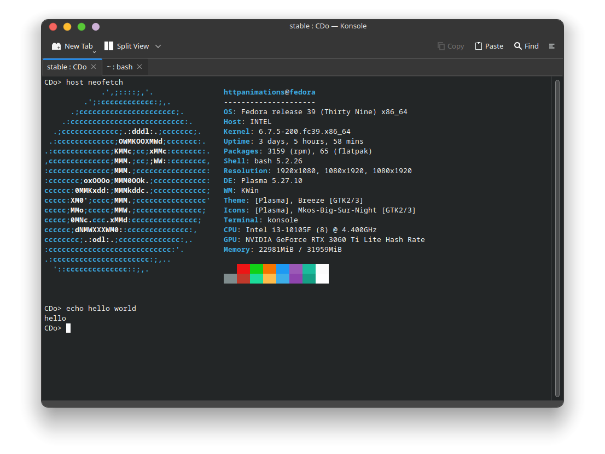

# Cdo/stable
A new type of os called a sub-os made to be ran on a host then be able to pick and byte data that won't effect the host os.



# Commands

## read
The read command will read out a file similer to cat on unix
```cdo
CDo> read compile.bash
gcc -o Cdo cdo.c
```

## echo
This will repeat a message sent to the app
```cdo
Cdo> echo Hello, World!
Hello, World!
```

## ls
This is will print current files in the dir enterd.
```cdo
Cdo> ls
file 1
folder 1
file 2
file 3
...
file 69
```

## clear
Clears the console.
```cdo
Cdo> clear
```

## exit
Exits the script into the host os
```cdo
Cdo> exit
$/
```

## host
Allows you to run host commands
```cdo
Cdo> host neofetch
Pretend theres a neofetch command here it would not copy write
```

## help
Shows a help message.
```cdo
Cdo> help
message about help here
```

## mkdir
Makes a dir.
```cdo
Cdo> mkdir folderone
Cdo> ls
...
folderone
...
```

## ping
Pings a url to get data.
```cdo
CDo> ping google.com
Error: Invalid URL format.
CDo> ping https://google.com
Pinging google.com...
PING google.com (142.250.176.14) 56(84) bytes of data.
64 bytes from lax17s51-in-f14.1e100.net (142.250.176.14): icmp_seq=1 ttl=117 time=35.4 ms
64 bytes from lax17s51-in-f14.1e100.net (142.250.176.14): icmp_seq=2 ttl=117 time=38.4 ms
64 bytes from lax17s51-in-f14.1e100.net (142.250.176.14): icmp_seq=3 ttl=117 time=36.6 ms
64 bytes from lax17s51-in-f14.1e100.net (142.250.176.14): icmp_seq=4 ttl=117 time=35.9 ms

--- google.com ping statistics ---
4 packets transmitted, 4 received, 0% packet loss, time 3004ms
rtt min/avg/max/mdev = 35.433/36.581/38.411/1.137 ms
CDo> 
```