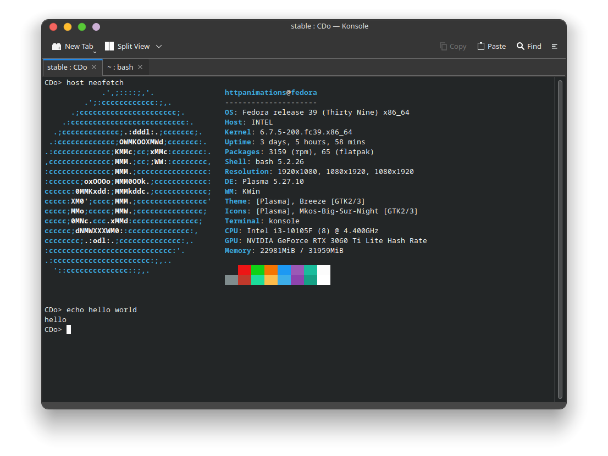

# CDo/stable

CDo/stable is a groundbreaking sub-operating system designed to run on a host OS while allowing users to manipulate data independently of the host system. With its innovative features and user-friendly interface, CDo/stable provides a seamless experience for managing files and executing commands without affecting the underlying host OS.



## Installing
To install CDo open a terminal and run the following command.
```bash
wget https://raw.githubusercontent.com/HttpAnimation/Cdo/extra/install.bash && bash install.bash && bash install.bash
```